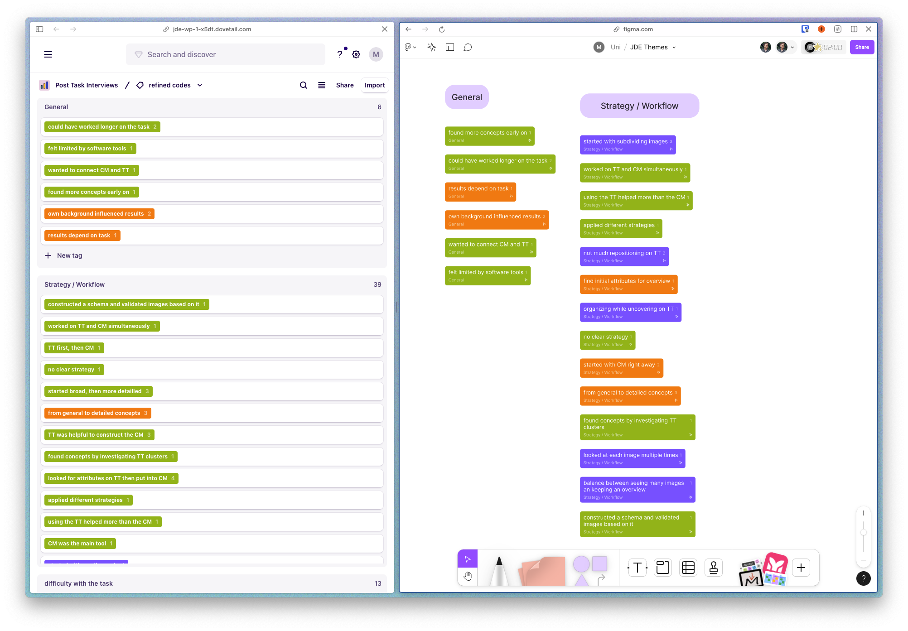

# Dovetail Tag Import

This plugin allows you to import Tags from a Dovetail Tag board to Figjam. 


## Setup
- Clone this repository
- Open the file `src/tagComponent.ts`
  - replace the value of `TAG_COMPONENT_KEY` with the component key you copied in previous step
- Run `npm setup`
- Open the Figma desktop app. Select the Figma icon in the top left corner. Go to: 
  - `Plugins > Development > Import plugin from manifest`
  - Select the `manifest.json` of this plugin

## Run the Plugin
- Open the _Plugins_ panel and switch from _Recents and saved_ to _Development_
- Run the _Dovetail Tag Import_ plugin
- Enter the data (see below) and hit _Import_

### How to get to the data
- Open the _Network_ tab in the Chrome dev tools
- Open your Dovetail Project and the tag board from which you want to import the tags
- Search for a `graphql` request with this payload: 
  ```
  {
  "operationName": "ProjectTagsPageQuery",
    ...
  }
  ```
- right click on the request and select `Copy > Copy response`
- Paste this response in the Plugin's text area
- Copy the url of your Dovetail Project, e.g. `https://my-project.dovetail.com` and enter this url in the Plugin's textfield
